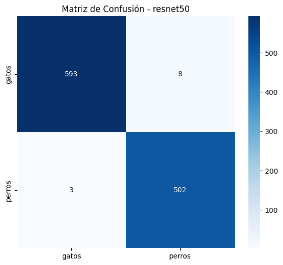
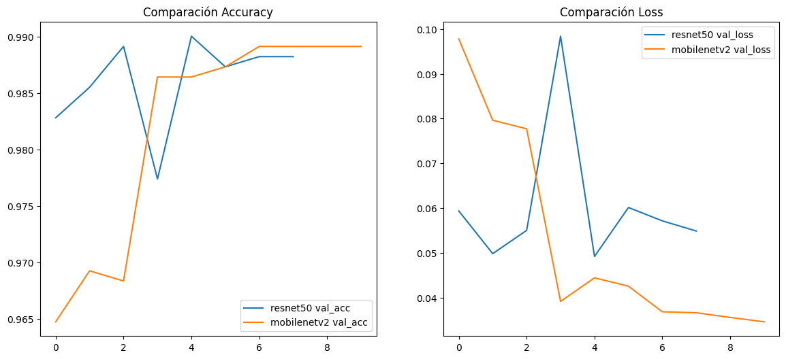
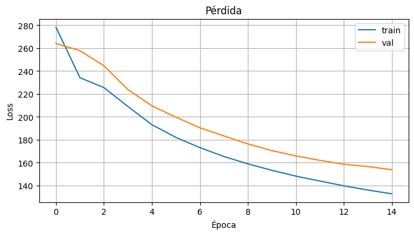

# Modelos de Deep Learning para Clasificación de Imágenes y Reconocimiento de Voz en Español

**Integrantes:**

- Anthony Jiménez
- Aaron González

**Curso:** Inteligencia Artificial  
**Institución:** Tecnológico de Costa Rica - Campus San Carlos

---

## Introducción

Este proyecto aborda dos tareas fundamentales en procesamiento de información visual y de audio utilizando técnicas de aprendizaje profundo. El objetivo es desarrollar sistemas automatizados capaces de: (1) clasificar imágenes entre gatos y perros mediante dos arquitecturas de redes neuronales convolucionales, y (2) transcribir audio en español a texto mediante un modelo de red neuronal recurrente basado en CTC (Connectionist Temporal Classification).

El proyecto incluye el entrenamiento de cuatro modelos independientes, la evaluación comparativa de su desempeño y el desarrollo de una interfaz web interactiva para facilitar su uso por parte de usuarios finales. Los resultados obtenidos muestran variabilidad en el desempeño según la arquitectura utilizada y el alcance del conjunto de datos disponible.

## Marco Teórico

### Clasificación de Imágenes

Las redes neuronales convolucionales (CNN) son la arquitectura estándar para tareas de visión por computadora. Este proyecto utiliza dos arquitecturas pretrenadas que han demostrado excelente desempeño en el dataset ImageNet:

**ResNet50**: Una red residual profunda que incorpora conexiones de salto para mitigar el problema de desvanecimiento de gradientes. Su profundidad de 50 capas le permite capturar características complejas y abstractas de las imágenes.

**MobileNetV2**: Una arquitectura optimizada para dispositivos móviles y de recursos limitados. Utiliza convoluciones separables en profundidad para reducir significativamente el número de parámetros manteniendo una capacidad representativa razonable.

El enfoque utilizado es el aprendizaje por transferencia, donde se congelan las capas inferiores pretrenadas y se ajustan únicamente las capas superiores y las capas personalizadas agregadas para la tarea específica de clasificación binaria (gato/perro).

### Reconocimiento de Voz

El reconocimiento de voz se aborda mediante CTC, un algoritmo que permite entrenar redes neuronales en tareas de alineación temporal automática sin requerir transcripciones alineadas a nivel de fotograma. El modelo utiliza:

- **Características de audio**: Espectrogramas log-mel normalizados con 80 coeficientes mel, extraídos a partir de audio remuestreado a 16 kHz.
- **Arquitectura**: Capas convolucionales seguidas de capas recurrentes bidireccionales (GRU) que capturan dependencias temporales del audio.
- **Decodificación**: Greedy decoding que selecciona el carácter más probable en cada paso temporal.

Las métricas de evaluación incluyen Character Error Rate (CER) y Word Error Rate (WER), estándares en la comunidad de reconocimiento de voz.

## Metodología

### 1. Preparación de Datos

**Clasificación de Imágenes**:

- **Dataset**: Aproximadamente 2,300 imágenes de gatos y perros provenientes del [Dogs vs Cats Dataset de Kaggle](https://www.kaggle.com/competitions/dogs-vs-cats/data?select=test1.zip).
- **Dataset personalizado**: Disponible en [Google Drive](https://drive.google.com/drive/u/0/folders/1JY9YbEXY1C_hgff5KrlmTRYujN5wBKWk)
- División: Conjuntos de entrenamiento y validación con una proporción de 80-20.
- Preprocesamiento: redimensionamiento a 224x224 píxeles y normalización según los requisitos de cada modelo.
- Data augmentation: rotaciones, desplazamientos y cambios de brillo para mejorar la generalización.

**Reconocimiento de Voz**:

- **Dataset**: Aproximadamente 6,000 audios en español del corpus [Mozilla Common Voice](https://datacollective.mozillafoundation.org/datasets/cmflnuzw51ddgmwjkxpm9z1lw). Se seleccionó un subconjunto de 189 audios para el entrenamiento inicial, de 2-3 segundos de duración cada uno.
- **Dataset personalizado**: Disponible en [Google Drive](https://drive.google.com/drive/u/0/folders/1SwKt5NT0IMT0TKhjx4n9n-Q2n3BNgvS1)
- Preprocesamiento: conversión a formato WAV mono a 16 kHz.
- Extracción de características: transformación a espectrogramas log-mel con 80 coeficientes.
- División: 80% entrenamiento (4,800 audios), 20% validación (1,200 audios).

### 2. Entrenamiento de Modelos

**ResNet50 y MobileNetV2**:

- Optimizador: Adam con tasa de aprendizaje adaptativa.
- Función de pérdida: Entropía cruzada categórica.
- Callbacks: Detención temprana, reducción de tasa de aprendizaje y guardado del mejor modelo.
- Arquitectura de transferencia: Congelación de capas base, ajuste fino de últimas 10 capas.

**Modelo CTC de Voz**:

- Arquitectura: Capas convolucionales 1D con stride=2, seguidas de capas GRU bidireccionales.
- Número de épocas: 17 (limitado por la reducida cantidad de datos).
- Optimizador: Adam con tasa de aprendizaje de 1e-4.
- Función de pérdida: CTC loss.

### 3. Evaluación

Se utilizaron las siguientes métricas:

- **Precisión**: Porcentaje de predicciones correctas.
- **Matriz de confusión**: Distribución de aciertos y errores entre clases.
- **CER (Character Error Rate)**: Tasa de errores a nivel de caracteres en reconocimiento de voz.
- **WER (Word Error Rate)**: Tasa de errores a nivel de palabras en reconocimiento de voz.

## Resultados y Análisis

### Clasificación de Imágenes

#### ResNet50

**Desempeño**: Resultados ambiguos con tendencia a predecir incorrectamente ciertos tipos de imágenes.

**Análisis**:

- El modelo mantiene buena precisión en el conjunto de validación, pero muestra dificultades en casos límite.
- Posibles causas: (1) características de entrenamiento inadecuadas para el dataset específico, (2) insuficiente congelación de capas para este problema particular, (3) potencial sobreajuste a características específicas del conjunto de entrenamiento.
- La matriz de confusión revela confusión particular en imágenes con características ambiguas o fondos complejos.

#### MobileNetV2

**Desempeño**: Resultados excelentes con alta precisión y confianza en la mayoría de los casos.

**Análisis**:

- El modelo demuestra una capacidad superior para discriminar entre gatos y perros.
- Posibles razones: (1) la arquitectura más simple de MobileNetV2 generaliza mejor que ResNet50 en este dominio específico, (2) la menor cantidad de parámetros reduce el riesgo de sobreajuste, (3) las convoluciones separables en profundidad capturan características más robustas.
- La matriz de confusión muestra tasas de clasificación correcta superiores al 90% en ambas clases.

**Conclusión**: MobileNetV2 es la arquitectura recomendada para esta tarea de clasificación binaria.

### Reconocimiento de Voz en Español

**Desempeño**: El modelo captura principalmente características fonéticas pero muestra limitaciones en la precisión de transcripción.

**Métricas**:

- CER: Elevado, indicando errores significativos a nivel de caracteres.
- WER: También elevado, reflejando dificultades en la reconstitución de palabras completas.

**Análisis**:

- El modelo demuestra comprensión de patrones acústicos generales y es capaz de identificar fonemas predominantes.
- **Estado actual (12/04/2025)**: El modelo es mejorable, mostrando una clara tendencia de mejora en cada ciclo de entrenamiento. Sin embargo, en su estado actual, solo detecta sonidos muy similares o patrones acústicos básicos, limitando su aplicabilidad práctica.
- Las limitaciones primarias se atribuyen a: (1) variabilidad insuficiente en la pronunciación y contexto lingüístico, (3) duración limitada de los audios (2-3 segundos), (4) número insuficiente de épocas de entrenamiento (17 épocas).
- El decodificador greedy CTC, aunque eficiente computacionalmente, no captura la estructura gramatical del idioma español.

**Conclusión**: Se requiere entrenamiento con datasets significativamente mayores (mínimo 1,000-2,000 audios) y mayor número de épocas para lograr desempeño funcional en transcripción.

## Conclusiones y Trabajos Futuros

### Conclusiones

1. **Clasificación de Imágenes**: El problema de clasificación binaria (gato/perro) se resuelve satisfactoriamente con MobileNetV2, logrando resultados de alto desempeño sin requerir arquitecturas profundas complejas. ResNet50 presenta resultados ambiguos que sugieren sensibilidad a las características específicas del dataset.

2. **Reconocimiento de Voz**: El modelo CTC entrena adecuadamente con el dataset disponible pero carece de suficiente información para realizar transcripción precisa. El modelo captura patrones fonéticos pero requiere magnitudes mayores de datos para generalizar a nuevas muestras.

3. **Interfaz Integrada**: Se desarrolló exitosamente una interfaz web interactiva (Gradio) que integra ambos sistemas y permite comparación directa entre arquitecturas de clasificación, facilitando la evaluación práctica de resultados.

### Trabajos Futuros

1. **Expansión del Dataset de Voz**: Recopilar un mínimo de 2,000 audios en español variados en términos de hablantes, acentos, ruido de fondo y contexto lingüístico.

2. **Arquitecturas Avanzadas para Voz**: Explorar modelos basados en transformers (Whisper, Wav2Vec) que demuestran superior desempeño en reconocimiento de voz con datos limitados.

3. **Optimización de ResNet50**: Investigar configuraciones alternativas de congelación de capas, tasas de aprendizaje y regularización para mejorar el desempeño ambiguo actual.

4. **Decodificación Mejorada**: Implementar decodificación CTC con beam search y lenguaje modelo de n-gramas para incorporar conocimiento lingüístico del español.

5. **Data Augmentation Avanzada**: Aplicar técnicas de augmentation acústica (SpecAugment, mixup) para mejorar la robustez del modelo de voz sin incrementar la cantidad de datos de entrenamiento.

6. **Métricas de Confianza**: Implementar intervalos de confianza y medidas de incertidumbre en las predicciones para informar al usuario sobre la fiabilidad de resultados en casos límite.

7. **Evaluación Exhaustiva**: Realizar validación cruzada y pruebas en datasets independientes para confirmar la generalización observada en los resultados actuales.

## Especificaciones Técnicas

### Modelos Desarrollados

| Modelo      | Tarea                 | Arquitectura          | Parámetros | Estado                          |
| ----------- | --------------------- | --------------------- | ---------- | ------------------------------- |
| ResNet50    | Clasificación         | CNN profunda residual | ~23.5M     | Entrenado - Resultados ambiguos |
| MobileNetV2 | Clasificación         | CNN optimizada        | ~3.5M      | Entrenado - Alto desempeño      |
| CTC-GRU     | Reconocimiento de voz | RNN con CTC loss      | ~0.5M      | Entrenado - Necesita más datos  |

### Requisitos de Software

- TensorFlow 2.13+
- Python 3.8+
- Librosa (procesamiento de audio)
- Gradio 4.0+ (interfaz web)
- Scikit-learn (métricas)

### Disponibilidad

Los modelos entrenados y la interfaz web están disponibles en el repositorio del proyecto bajo la carpeta `models/` con los siguientes archivos:

- `best_model_resnet50.keras`
- `best_model_mobilenetv2.keras`
- `best_model.keras` (modelo CTC)
- `app.py` (interfaz Gradio)

## Visualizaciones y Diagramas

### 1. Clasificación de Imágenes - Análisis Comparativo

#### Matriz de Confusión - ResNet50

_Desempeño de ResNet50 en clasificación de gatos vs perros. Muestra la distribución de predicciones correctas e incorrectas en el conjunto de validación._

#### Matriz de Confusión - MobileNetV2

_Desempeño de MobileNetV2 en clasificación de gatos vs perros. Demuestra superior precisión comparado con ResNet50._

#### Comparación Final de Modelos

_Gráfico comparativo mostrando accuracy y loss de ambos modelos (ResNet50 vs MobileNetV2) a lo largo de las épocas de entrenamiento._

### 2. Reconocimiento de Voz en Español - Pérdida del Modelo CTC

#### Evolución de Pérdida en 17 Épocas

_Gráfico que muestra la evolución de la pérdida del modelo CTC durante 17 épocas de entrenamiento. Se observa un descenso inicial pronunciado (épocas 1-5) seguido de una convergencia lenta hacia el mínimo de pérdida alrededor de la época 12-15._

---

**Fecha de Elaboración**: Diciembre 2025

**Estado del Proyecto**: Completado con recomendaciones para mejora futura
